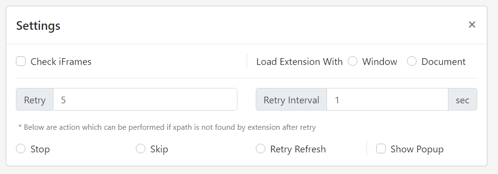

# Settings

{:width="100%"}

You can control how and when should extension connect with your configured site.

---
## Check Iframe

If an action need to be performed on button / input field which is inside iframe you must check this checkbox which enables check of iframe content as well.

---
## Extension Load

- [Window](https://developer.mozilla.org/en-US/docs/Web/API/GlobalEventHandlers/onload) (default)
  - Extension is loaded when all content of page is loaded e.g. stylesheets, images, subforms 
  - Slower than Document
- [Document](https://developer.mozilla.org/en-US/docs/Web/API/Window/DOMContentLoaded_event)
  - Extension is loaded without waiting for stylesheets, images, and subframes to finish loading 
  - Faster than Window
 
---
## Retry & Retry Interval
Retry finding [xpath](xpath) in webpage for number of times provided. default is `5`

### Example
- positive numeric value `1` to `999`

---
## Retry Interval
Retry Interval will wait for no of sec provided before [retry](retry) to find [xpath](xpath) of [action](action). default is `1` sec



---
## Error Handling
Select what should happen if XPath is not found after no of retry.
- `Stop` (default) - Do nothing. Stop extension without procedding further
- `Skip` - Skip current action and continue next action
- `Refresh Page` - Refresh whole page

---
## Show Notification
This is very important feature of extension which tells you if any error occur in extension while executing. Or if any XPath provided is not found or wrong. Select this option while configuring and uncheck once you have finished configuring.

---
## Export & Import
You can export and import whole configuration anytime and keep it as back

Import functionality will override all current configuration. Make sure before performing this operation