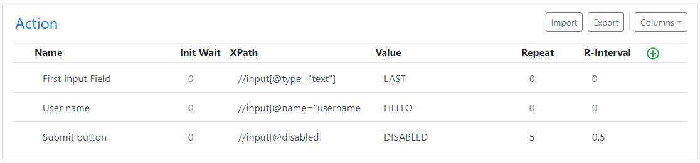

# Action

action is combination of
- [Action](#action)
  - [Init Wait](#init-wait)
    - [Example](#example)
  - [XPath](#xpath)
    - [Follow below steps to get XPath](#follow-below-steps-to-get-xpath)
    - [Examples](#examples)
  - [Value](#value)
  - [Repeat & Repeat interval](#repeat--repeat-interval)
    - [Example](#example-1)

---
## Init Wait
Init Wait stands for Initial Wait. Initial Wait to start particular action. Waiting time is provided in sec. It can be used were extension starts but it require few sec for page to load fully.

### Example
* `1`
* `1.5`
* `0.5`
* `1e4` (Random value between 1 to 4)
* Leave it `blank`/`empty` to start right away 

> Its not mandatory field. if left blank extension will start executing right away.

---
## XPath
Its little tricky but believe me its not that hard to find.

### Follow below steps to get XPath
1. Right click any button or link or whaterver you want to click in webpage and select Inspect.
2. It will open developer console and highlight that element under Elements Tab
3. Right click that element and select Copy > Copy XPath.

Thats it you have your XPath of that element now.

### Examples

| XPath | HTML |
| ------ | ------ |
|//div/a[1]|`

`|

**[Click here](action/xpath.md) to find more XPath Examples**

---
## Value

Suppose you are performing action on `input`|`textarea`|`dropdown` you should provide one extra field that is value for [XPath](XPath) you have added.

> This is mandatory field only if XPath element is `input`|`textarea`|`dropdown`.

---
## Repeat & Repeat interval
If you want specific `action` to repeat more than once you can provide `repeat` value. 
If you want to control the time between each repeat you can provide `repeat Interval` as well.

### Example

**Repeat**
- positive numeric value `1` to `999`

**Repeat Interval**
* `1`
* `1.5`
* `0.5`
* `2`
* `1e4` (Random value between 1 to 4)
* `empty` | `blank`